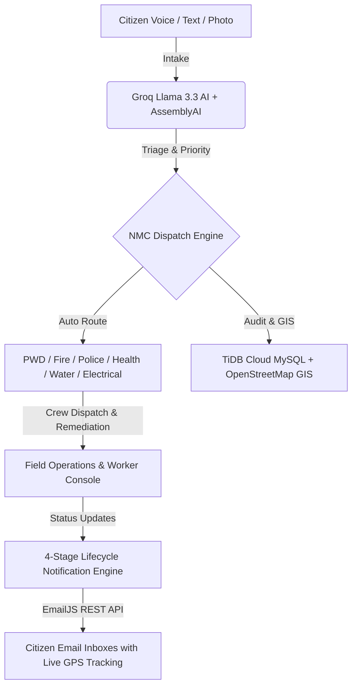

<div align="center">

# 🏛️ Nagpur Connect (नागपूर कनेक्ट)
### AI-Powered Civic Incident Response & Municipal Dispatch Platform

[](https://nextjs.org/)
[](https://react.dev/)
[](https://tidbcloud.com/)
[](https://groq.com/)
[](https://assemblyai.com/)
[](https://www.emailjs.com/)

**Official Civic Platform for Nagpur Municipal Corporation (NMC)**  
*Instant citizen incident intake via voice or text, autonomous AI triage, multi-department GIS routing, field crew dispatch, and automated citizen lifecycle email tracking.*

[🌐 Live Production Portal](https://nagpur-connect.vercel.app) • [📱 Citizen Reporting Flow](https://nagpur-connect.vercel.app/report) • [📊 Admin Command Center](https://nagpur-connect.vercel.app/admin) • [🏛️ Department Hub](https://nagpur-connect.vercel.app/department)

---

</div>

## 🌟 Key Highlights & System Architecture



### 1. 🎙️ Multi-Lingual AI Voice & Speech Intake
- **AssemblyAI v3 Real-Time Streaming:** Direct Opus WebSocket streaming (`universal-3-5-pro`) for instantaneous live transcription.
- **Groq Whisper Large v3 Turbo:** Ultra-fast multi-language transcription for mobile audio uploads with auto-language detection (English, Hindi, Marathi).
- **Native Browser Web Speech Engine:** Built-in continuous speech accumulation that seamlessly preserves full sentences even with 1–2 second pauses.
- **Auto-Failover Resilience:** Transparent automatic failover between streaming AI and native browser recognition with zero user interruption.

### 2. 🧠 Autonomous Civic AI Reasoning (Groq Llama 3.3 70B)
- Evaluates raw civic reports and extracts category, subcategory, urgency, severity rating (`CRITICAL`, `HIGH`, `MEDIUM`, `LOW`), and emergency status.
- Automatically calculates the responsible municipal departments (PWD, Fire Brigade, Water Works, Solid Waste, Garden, Electrical, Health, Police, etc.).
- Dynamically generates department-specific triage questions to guide the citizen.

### 3. 🗺️ Live GIS & Interactive OpenStreetMap Dispatch
- Embedded interactive OpenStreetMap mini-maps for every reported incident with GPS coordinates and verified location tags.
- Admin City Command Map with real-time incident pins, heat layers, department filters, and a live **Top 10 Recent Locations Bar** with 1-click camera pan and zoom.

### 4. 🏢 Department Operations & Dispatch Consoles
- Dedicated portals for each municipal department (`/department/fire_brigade`, `/department/pwd`, etc.).
- **Master-Detail Layout:** Left-hand live queue with status badges + right-hand sticky investigation & crew dispatch console.
- Multi-station and facility directories with live personnel roster and active work orders.
- Comprehensive SLA analytics with average turnaround time and department KPI charts.

### 5. 📬 4-Stage EmailJS Automated Lifecycle Tracking
- Pure light-theme, responsive civic email template delivered across every milestone:
  1. **Stage 1 (Submitted):** Incident registered and queued with official Reference ID (`#NAG-2026-XXXX`).
  2. **Stage 2 (Routed):** Reviewed and acknowledged by the handling municipal department.
  3. **Stage 3 (In Progress):** Field crew and rapid response units dispatched to the site with remediation notes.
  4. **Stage 4 (Resolved):** Remediation completed and verified with officer closure notes.
- Embedded **Quick Navigation Bar** with direct redirection buttons to the live report tracker, citizen dashboard, report history, and emergency services.

---

## 🛠️ Technology Stack

| Layer | Technologies |
| :--- | :--- |
| **Framework** | [Next.js 16.3.1](https://nextjs.org/) (App Router, Turbopack, Server Actions) |
| **UI & Styling** | [React 19.2.8](https://react.dev/), Vanilla CSS & Tailwind CSS 4 Design Tokens, Inter & Plus Jakarta Sans |
| **Database** | [TiDB Cloud Serverless MySQL](https://tidbcloud.com/) (SSL-enabled connection pooling, ULID keys) |
| **Generative AI** | [Groq](https://groq.com/) (Llama 3.3 70B Versatile, Whisper Large v3 Turbo) |
| **Speech-to-Text** | [AssemblyAI v3](https://www.assemblyai.com/) Real-Time Streaming & Web Speech API |
| **Email Lifecycle** | [EmailJS](https://www.emailjs.com/) REST API with dynamic templating |
| **Mapping & GIS** | [Leaflet](https://leafletjs.com/), [React Leaflet](https://react-leaflet.js.org/), OpenStreetMap |
| **Authentication** | [NextAuth.js v5 Beta](https://next-auth.js.org/), Google OAuth 2.0, Guest UUID Session Provider |

---

## 📁 Repository Structure

```text
nagpur-connect/
├── docs/                                # Documentation & integration guides
│   ├── EMAILJS_SETUP.md                 # Complete EmailJS step-by-step setup guide
│   ├── emailjs-templates.html           # Copy-pasteable light-theme HTML email template
│   └── api.md                           # REST API endpoint specifications
├── data/
│   └── geodata/                         # Municipal boundary & zonal GeoJSON datasets
├── public/                              # Static public assets & favicons
│   ├── favicon.png                      # Rounded squircle app favicon
│   ├── apple-touch-icon.png             # Mobile home screen icon
│   └── sw.js                            # PWA Service Worker for push notifications
├── src/
│   ├── app/                             # Next.js App Router (49 routes)
│   │   ├── (public)/                    # Landing (/), emergency (/emergency), track (/track)
│   │   ├── (citizen)/                   # Report intake (/report), dashboard (/dashboard/[ref]), reports (/my-reports)
│   │   ├── (admin)/admin/               # Command center, incident map, analytics, audit log, users
│   │   ├── (department)/department/     # Department triage, dispatch, facility directory, SLA
│   │   ├── (worker)/worker/             # Field worker mobile portal & task completion
│   │   ├── api/                         # Backend REST endpoints & webhook handlers
│   │   ├── layout.tsx                   # Root metadata, theme provider, and icon config
│   │   └── globals.css                  # Design system tokens and typography
│   ├── components/                      # Reusable UI component library
│   │   ├── citizen/                     # Tracking timeline, citizen navigation, report cards
│   │   ├── department/                  # Incident cards, dispatch console, department header
│   │   ├── layout/                      # Navbar, footer, navigation bars
│   │   └── ui/                          # Button, Modal, Badge, ThemeToggle, SVG Icons
│   ├── lib/                             # Core backend services & utilities
│   │   ├── db.ts                        # MySQL2 connection pool with TiDB SSL support
│   │   ├── email-service.ts             # EmailJS REST API 4-stage lifecycle dispatcher
│   │   ├── notification-service.ts      # Multi-channel notification router
│   │   ├── department-registry.ts       # Municipal department registry & category mappings
│   │   └── env.ts                       # Environment variable parser & validation
│   └── modules/                         # Core domain logic
│       ├── ai/                          # Groq Llama 3.3 prompt templates & parsers
│       ├── geo/                         # GeoJSON spatial routing & boundary checkers
│       └── speech/                      # AssemblyAI streaming provider & speech hooks
├── env.download                         # Reference environment variable configuration
└── package.json                         # Project dependencies and npm scripts
```

---

## ⚡ Quick Start & Setup

### 1. Prerequisites
- **Node.js:** v18.18+ or v20+
- **npm:** v9+
- **TiDB Cloud / MySQL:** Active database instance

### 2. Installation & Environment Configuration
```bash
# Clone the repository
git clone https://github.com/poojakonge/nagpur-connect.git
cd nagpur-connect

# Install dependencies
npm install

# Configure environment variables
cp env.download .env.local
```

Edit `.env.local` with your credentials:
```ini
# Database
DATABASE_HOST=gateway01.ap-southeast-1.prod.aws.tidbcloud.com
DATABASE_PORT=4000
DATABASE_USER=your_tidb_user
DATABASE_PASSWORD=your_tidb_password
DATABASE_NAME=nagpur_connect

# AI Engines
GROQ_LLAMA_API_KEY=gsk_...
ASSEMBLY_AI_MODEL=your_assemblyai_api_key

# Application Base URL
NEXT_PUBLIC_APP_URL=https://nagpur-connect.vercel.app

# EmailJS Configuration
EMAILJS_SERVICE_ID=service_zdtdw8a
EMAILJS_TEMPLATE_ID=template_dtaszud
EMAILJS_PUBLIC_KEY=mcwRaEW_RhQlmLFeL
EMAILJS_PRIVATE_KEY=uVVNPCccuj896jFfOdL_j
EMAILJS_CONNECTED_EMAIL=mesapos.in@gmail.com
```

### 3. Run Development Server
```bash
npm run dev
```
Open [http://localhost:3000](http://localhost:3000) in your browser.

### 4. Build for Production
```bash
npm run build
npm run start
```

---

## 🌐 Portal Routes Reference

| Route | Audience | Description |
| :--- | :--- | :--- |
| `/` | Public | Nagpur Connect landing page with live city statistics |
| `/report` | Citizen | Multi-modal voice/text incident intake & AI analysis |
| `/dashboard/[reference]` | Citizen | Live tracking timeline with OpenStreetMap mini-map |
| `/my-reports` | Citizen | Complete chronological incident history |
| `/emergency` | Citizen / Public | One-tap emergency quick-dial and hospital helpline |
| `/track` | Public | Universal reference lookup tool (`#NAG-2026-XXXXXX`) |
| `/department` | Department Staff | Central department hub across all 10 municipal divisions |
| `/department/[code]/incidents` | Department Staff | Master-detail incident desk & crew dispatch console |
| `/department/[code]/workers` | Department Staff | Stations, facilities, and field crew directory |
| `/department/[code]/analytics` | Department Staff | SLA performance, response time, and closure rate |
| `/admin` | City Leadership | Executive overview, operational KPIs, and active counts |
| `/admin/map` | City Leadership | Live full-screen incident map with top 10 recent focus bar |
| `/admin/incidents` | City Leadership | Universal incident registry with cross-department triage |
| `/admin/audit` | City Leadership | Immutable audit logging and security event tracker |

---

## 🛡️ Security & Privacy Standards
- **SSL Enforced Connections:** TiDB database queries run with mandatory TLS/SSL identity verification.
- **Privacy Partitioning:** Public, Restricted, and Sensitive visibility tiers for incident reports and attached media.
- **Ephemeral Token Exchange:** AssemblyAI API keys remain strictly secure on the server; client browsers only receive short-lived (5-minute) signed tokens.
- **Role-Based Access Control (RBAC):** Distinct permission scopes for Citizens, Field Workers, Department Officers, and City Administrators.

---

## 📄 License & Attribution
© 2026 **Nagpur Municipal Corporation (NMC)** & **Nagpur Connect Team**. All rights reserved.
